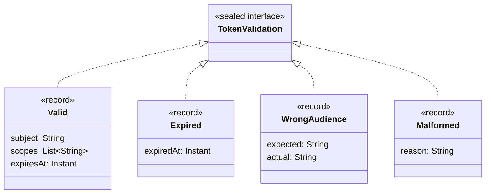
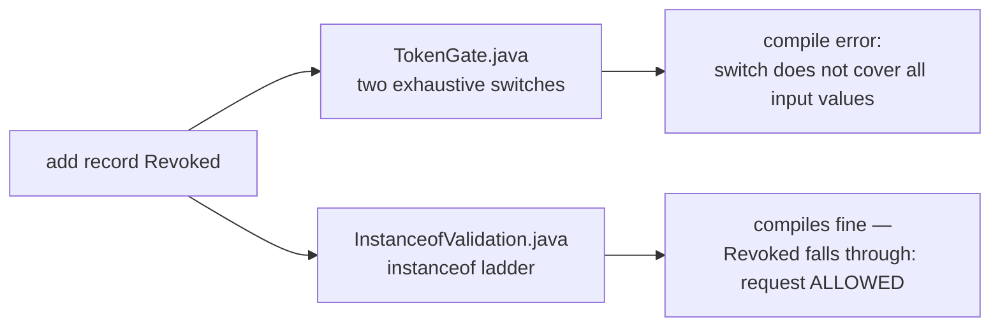

# data-modeling

**Thesis in three sentences.** Records, sealed interfaces, and pattern matching are usually
taught as three separate features, but they are three thirds of ONE modeling primitive: the
sealed interface declares the closed set of alternatives, each record carries one alternative's
data, and the exhaustive `switch` is the consumer the compiler checks against that set. Model
token validation this way and "you forgot to handle the new outcome" stops being a code-review
catch and becomes a compile error — which matters here, because at a security gate the
unhandled outcome is a **fail-open** bug: the ladder's fall-through quietly becomes the policy
for every outcome you add later. Drop any one of the three and the other two lose that
guarantee — which is why using them piecemeal feels underwhelming and using them together
changes how you design.

## Run it

```
mise run data-modeling        # from the repo root
```

Or standalone from this folder:

```
mvn -q compile
java -cp target/classes dev.lukasgrigis.foundations.datamodeling.DataModelingDemo
```

## What to look at

All sources live in
[`src/main/java/dev/lukasgrigis/foundations/datamodeling/`](src/main/java/dev/lukasgrigis/foundations/datamodeling/):

- [`TokenValidation.java`](src/main/java/dev/lukasgrigis/foundations/datamodeling/TokenValidation.java)
  — the whole domain, one file: sealed interface + four records. Validating a bearer token ends
  in exactly one of `Valid`, `Expired`, `WrongAudience`, or `Malformed`.
- [`TokenGate.java`](src/main/java/dev/lukasgrigis/foundations/datamodeling/TokenGate.java) —
  two consumers, both exhaustive switches with **no `default`**. `deny` maps each outcome to an
  HTTP denial (RFC 6750 shape) — and `Valid` is visibly the only case that lets a request
  through. `auditLine` shows a `when` guard: a valid token expiring within 60 s gets a warning
  without losing exhaustiveness. Unused record components are unnamed (`_`).
- [`InstanceofValidation.java`](src/main/java/dev/lukasgrigis/foundations/datamodeling/InstanceofValidation.java)
  — the same gate as an `instanceof` ladder: match the failures you know, let the rest through.
  It agrees with the switch today; the demo verifies that at runtime. Its final fall-through is
  the fail-open branch this brick is about.
- [`DataModelingDemo.java`](src/main/java/dev/lukasgrigis/foundations/datamodeling/DataModelingDemo.java)
  — runs a fixed set of outcomes through both consumers and prints the gate decisions, the
  audit lines, and the ladder-vs-switch sanity check.

The domain, exactly as in `TokenValidation.java`:



## The experiment

Add a fifth outcome to `TokenValidation`:

```java
record Revoked(String reason) implements TokenValidation {}
```

Both switches in `TokenGate.java` stop compiling
(`the switch expression does not cover all possible input values`);
the `instanceof` ladder compiles without a sound — and a revoked token now sails through the
gate, because "not a known failure" is the ladder's definition of valid. That is a fail-open
security bug the compiler never sees in the ladder, and cannot miss in the switch.



Revert the record and the brick compiles clean again — the compiler was the only reviewer needed.
